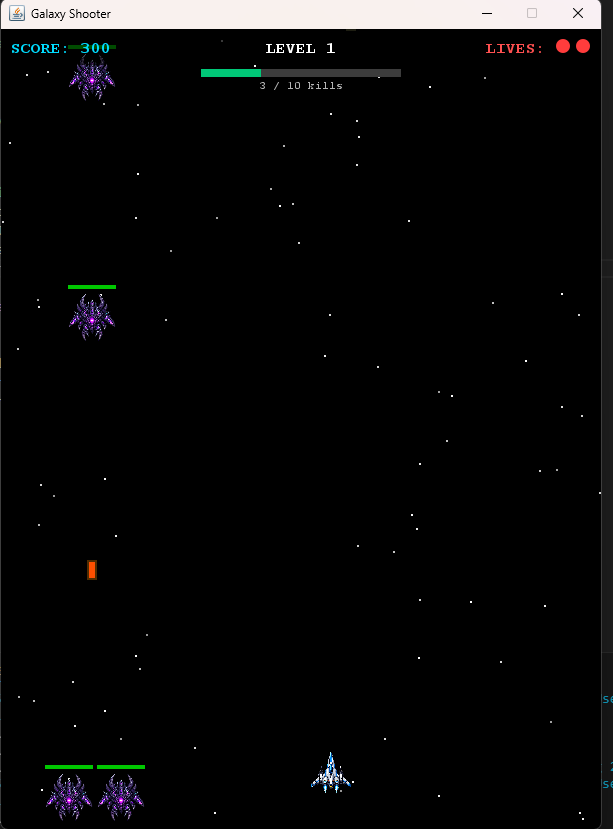
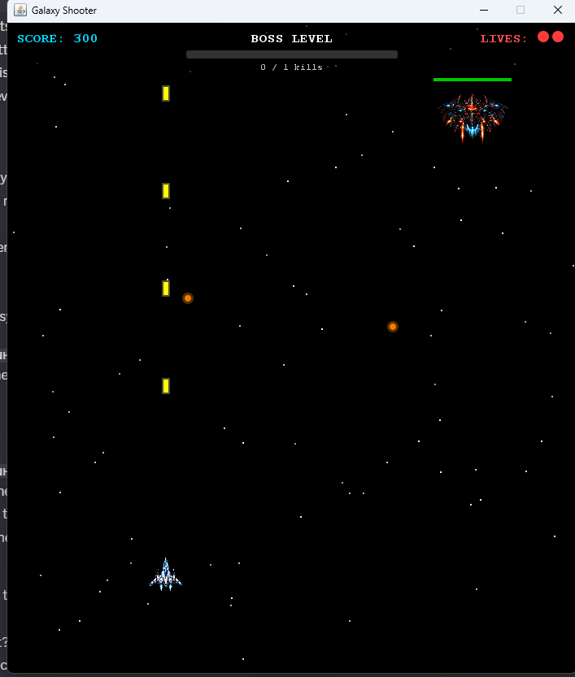

# Galaxy Shooter
**CS 3354 – Object‑Oriented Design Project**

Galaxy Shooter is a 2D space‑shooter game implemented in Java using Swing.  
---



## Features
- Smooth player movement and shooting
- Multiple enemy types (basic, boss, final boss)
- Player and enemy health systems
- Collision detection for bullets, enemies, and the player
- Level progression with increasing difficulty
- Dedicated boss level
- Modular OOP class structure
- Game loop implemented in `GamePanel`

---

## Project Structure

### Core Files
- **Main.java** — Entry point; creates the game window and initializes the game panel  
- **GamePanel.java** — Main game loop, rendering, updates, and keyboard input  
- **Player.java** — Player ship logic: movement, shooting, and health  
- **PlayerBullet.java** — Bullets fired by the player  
- **Enemy.java** — Base class for all enemy types  
- **BasicEnemy.java** — Standard enemy with simple movement  
- **EnemyBullet.java** — Bullets fired by enemies  
- **SpreadBullet.java** — Enemy bullet that fires in multiple directions  
- **BossEnemy.java** — Mid‑boss enemy with unique behavior  
- **FinalBoss.java** — Final boss with advanced attack patterns  
- **Level.java** — Abstract base class for level implementations  
- **Level1.java** — First level  
- **Level2.java** — Second level  
- **Level3.java** — Third level  
- **BossLevel.java** — Boss fight level  

---

## Controls
- **Arrow Keys** — Move the player ship  
- **Spacebar** — Shoot  

---

## How to Run

1. Clone the repository:
   ```bash
    git clone https://github.com/deanb4/GalaxyShooter
    cd GalaxyShooter
    javac *.java
    java Main
    ```